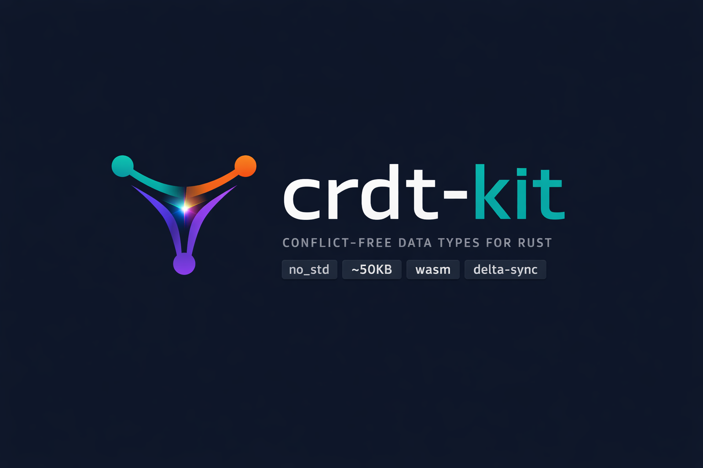

<div align="center">

<br>



<br><br>

[](https://crates.io/crates/crdt-kit)
[](https://crates.io/crates/crdt-kit)
[](https://docs.rs/crdt-kit)
[](https://github.com/crdt-kit/crdt-kit/actions)
[](LICENSE-MIT)

<br>

[**Documentation**](https://docs.rs/crdt-kit) &bull; [**Crate**](https://crates.io/crates/crdt-kit) &bull; [**Examples**](./crates/crdt-store/examples) &bull; [**Contributing**](CONTRIBUTING.md)

<br>

</div>

## Why crdt-kit?

Traditional sync solutions break when devices go offline. CRDTs solve this at the data structure level — every replica can be updated independently, and **merges always converge to the same result**, guaranteed by math, not by servers.

`crdt-kit` is built specifically for **resource-constrained, latency-sensitive environments** where existing solutions (Automerge, Yjs) add too much overhead:

```
+-----------+     +-----------+     +-----------+
|  Device A |     |  Device B |     |  Device C |
|  (offline)|     |  (offline)|     |  (offline)|
+-----+-----+     +-----+-----+     +-----+-----+
      |                 |                 |
      |  local edits    |  local edits    |  local edits
      |                 |                 |
      +--------+--------+--------+--------+
               |                 |
               v                 v
         +-----------+     +-----------+
         |   merge   |     |   merge   |
         +-----------+     +-----------+
               |                 |
               v                 v
          Same state!       Same state!    <-- Strong Eventual Consistency
```

### Key Advantages

| | `crdt-kit` | Automerge | Yjs |
|---|---|---|---|
| **Zero dependencies** (core) | Yes | No (30+) | No (N/A — JS) |
| **`no_std` / embedded** | Yes | No | No |
| **WASM-ready** | Yes | Partial | Native JS |
| **Persistent storage** | SQLite, redb, memory | Custom | N/A |
| **Schema migrations** | Automatic (lazy) | Manual | N/A |
| **Delta sync** | Yes | Yes | Yes |
| **Serde integration** | Yes | Custom | N/A |
| **Pure Rust** | Yes | Yes | No (JS) |

### Built For

| Environment | Why it matters |
|---|---|
| **IoT / Embedded** | `no_std` support — runs on bare metal, Raspberry Pi, ESP32 |
| **Mobile apps** | Offline-first with automatic conflict resolution on reconnect |
| **Edge computing** | Delta sync minimizes bandwidth between edge nodes |
| **P2P networks** | No central server needed — every peer is equal |
| **Real-time collaboration** | Concurrent edits merge without coordination |
| **WASM / Browser** | First-class WebAssembly bindings for web apps |

---

## Quick Start

```toml
[dependencies]
crdt-kit = "0.3"
```

```rust
use crdt_kit::prelude::*;

// Two devices, working offline
let mut phone = GCounter::new("phone");
phone.increment();
phone.increment();

let mut laptop = GCounter::new("laptop");
laptop.increment();

// When they reconnect — merge. Always converges.
phone.merge(&laptop);
assert_eq!(phone.value(), 3);
```

### With Persistence

```toml
[dependencies]
crdt-kit = { version = "0.3", features = ["serde"] }
crdt-store = { version = "0.1", features = ["sqlite"] }
```

```rust
use crdt_store::{CrdtDb, CrdtVersioned, SqliteStore};
use serde::{Serialize, Deserialize};

#[derive(Serialize, Deserialize)]
struct SensorReading { temperature: f32, humidity: f32 }

impl CrdtVersioned for SensorReading {
    const SCHEMA_VERSION: u8 = 1;
}

let store = SqliteStore::open("sensors.db").unwrap();
let mut db = CrdtDb::with_store(store);

// Save — automatically wrapped in a version envelope
db.save("sensor-42", &SensorReading { temperature: 22.5, humidity: 65.0 }).unwrap();

// Load — automatically migrated if the schema changed
let reading: Option<SensorReading> = db.load("sensor-42").unwrap();
```

---

## Workspace Architecture

`crdt-kit` is a multi-crate workspace. Use only what you need:

```
crdt-kit/
├── crates/
│   ├── crdt-kit/              9 CRDTs + HLC + traits (the core library)
│   ├── crdt-store/            Persistence: SQLite, redb, memory + CrdtDb API
│   ├── crdt-migrate/          Version envelopes + migration engine
│   ├── crdt-migrate-macros/   #[crdt_schema] + #[migration] proc macros
│   ├── crdt-codegen/          Code generation from TOML schemas
│   ├── crdt-cli/              CLI: status/inspect/compact/export/generate/dev-ui
│   ├── crdt-dev-ui/           Embedded web panel for database inspection
│   └── crdt-example-tasks/    Full example: codegen + migrations + events
```

| Crate | Description | Feature flags |
|---|---|---|
| **crdt-kit** | 9 CRDT types, HLC, Crdt/DeltaCrdt traits | `std`, `serde`, `wasm` |
| **crdt-store** | Unified storage abstraction + high-level CrdtDb | `sqlite`, `redb` |
| **crdt-migrate** | Transparent schema migrations (lazy, on-read) | `macros` |
| **crdt-codegen** | Generate structs, migrations, and helpers from TOML | — |
| **crdt-cli** | Developer CLI tool (`crdt` binary) | — |
| **crdt-dev-ui** | Web inspection panel (Axum, dark theme) | — |

---

## Persistence & Storage

Three backends, one trait surface:

| Backend | Feature | Use case | Dependencies |
|---|---|---|---|
| `MemoryStore` | *(always)* | Testing, prototyping | None |
| `SqliteStore` | `sqlite` | Edge Linux, mobile, desktop | rusqlite (bundled) |
| `RedbStore` | `redb` | Pure-Rust edge (no C deps) | redb |

All backends implement `StateStore` + `EventStore` with event sourcing, snapshots, and compaction:

```rust
use crdt_store::{EventStore, MemoryStore, StateStore};

let mut store = MemoryStore::new();

// State persistence
store.put("sensors", "s1", b"data").unwrap();

// Event sourcing
let seq = store.append_event("sensors", "s1", b"SetTemp(23.1)", 1000, "node-a").unwrap();

// Snapshots + compaction
store.save_snapshot("sensors", "s1", b"state", seq, 1).unwrap();
store.truncate_events_before("sensors", "s1", seq).unwrap();
```

---

## Schema Migrations

When your data evolves between app versions, `crdt-migrate` handles it transparently:

```rust
use crdt_migrate::{crdt_schema, migration};

#[crdt_schema(version = 1, table = "sensors")]
#[derive(Serialize, Deserialize)]
struct SensorV1 { device_id: String, temperature: f32 }

#[crdt_schema(version = 2, table = "sensors")]
#[derive(Serialize, Deserialize)]
struct SensorV2 { device_id: String, temperature: f32, humidity: Option<f32> }

#[migration(from = 1, to = 2)]
fn add_humidity(old: SensorV1) -> SensorV2 {
    SensorV2 { device_id: old.device_id, temperature: old.temperature, humidity: None }
}
```

- **Lazy**: Data migrates on read, not on startup
- **Deterministic**: Two devices migrating the same data produce identical results
- **Linear chain**: v1 → v2 → v3 → current, never skipping steps
- **Write-back**: Migrated data is re-persisted automatically

---

## Code Generation

Define your entities in a `crdt-schema.toml` file and generate all the Rust boilerplate:

```toml
[config]
output = "src/generated"

# Entity with CRDT-wrapped fields (conflict-free replicated)
[[entity]]
name = "Project"
table = "projects"

[[entity.versions]]
version = 1
fields = [
    { name = "name", type = "String", crdt = "LWWRegister" },
    { name = "members", type = "String", crdt = "ORSet" },
]

# Entity with plain fields, versioned schema, and a relation
[[entity]]
name = "Task"
table = "tasks"

[[entity.versions]]
version = 1
fields = [
    { name = "title", type = "String" },
    { name = "done", type = "bool" },
]

[[entity.versions]]
version = 2
fields = [
    { name = "title", type = "String" },
    { name = "done", type = "bool" },
    { name = "priority", type = "Option<u8>", default = "None" },
    { name = "tags", type = "Vec<String>", default = "Vec::new()" },
    { name = "project_id", type = "String", default = "String::new()", relation = "Project" },
]
```

```bash
$ crdt generate --schema crdt-schema.toml
  Generated: src/generated/project.rs
  Generated: src/generated/task.rs
  Generated: src/generated/task_migrations.rs
  Generated: src/generated/helpers.rs
  Generated: src/generated/mod.rs

Generated 5 files in src/generated/
```

**Field options:**

| Option | Example | Effect |
| --- | --- | --- |
| `type` | `"String"`, `"Vec<u8>"` | Rust type for the field |
| `default` | `"None"`, `"Vec::new()"` | Default value for migrations |
| `crdt` | `"LWWRegister"`, `"ORSet"`, `"GCounter"` | Wraps the type with a CRDT (e.g., `LWWRegister<String>`) |
| `relation` | `"Project"` | Documents a reference to another entity |

Supported CRDT types: `GCounter`, `PNCounter`, `LWWRegister`, `MVRegister`, `GSet`, `TwoPSet`, `ORSet`

**What gets generated:**

- `project.rs` / `task.rs` — Versioned structs with `#[crdt_schema]`, CRDT-wrapped field types, and `type Project = ProjectV1`
- `task_migrations.rs` — Migration functions with `#[migration]` (auto-generated for field additions, CRDT fields get auto-defaults)
- `helpers.rs` — `create_db()` and `create_memory_db()` with all migrations pre-registered
- `mod.rs` — Module declarations and re-exports

All files are marked `AUTO-GENERATED by crdt-codegen -- DO NOT EDIT`.

See [`crdt-example-tasks`](./crates/crdt-example-tasks) for a complete working example.

---

## Developer Tools

### CLI

```bash
$ crdt status app.db          # Database overview
$ crdt inspect app.db sensor-42 --events  # Entity detail + event log
$ crdt compact app.db --threshold 100     # Snapshot + truncate events
$ crdt export app.db --namespace sensors  # JSON export
$ crdt generate --schema crdt-schema.toml # Generate code from TOML
$ crdt dev-ui app.db          # Launch web inspector
```

### Dev UI

A dark-themed web panel for visual database inspection during development:

```bash
$ crdt dev-ui app.db
  Dev UI: http://localhost:4242
```

Browse namespaces, entities, event logs, version envelopes, and snapshots — all from your browser.

---

## Edge Computing & IoT

`crdt-kit` is purpose-built for edge environments. Import it with `no_std` for bare metal or with `serde` for network serialization:

```toml
# Raspberry Pi / ESP32 / bare metal (no standard library)
[dependencies]
crdt-kit = { version = "0.3", default-features = false }

# Edge node with JSON sync over MQTT/HTTP
[dependencies]
crdt-kit = { version = "0.3", features = ["serde"] }
serde_json = "1"
```

```rust
use crdt_kit::prelude::*;

// Edge sensor node collects temperature readings
let mut sensor_a = GCounter::new("sensor-a");
let mut sensor_b = GCounter::new("sensor-b");

// Each sensor counts events independently (no network needed)
sensor_a.increment_by(142); // 142 events detected
sensor_b.increment_by(89);  // 89 events detected

// When the gateway collects data — merge. Order doesn't matter.
sensor_a.merge(&sensor_b);
assert_eq!(sensor_a.value(), 231); // exact total, no double-counting

// Delta sync: only send what changed (saves bandwidth on LoRa/BLE)
let mut gateway = GCounter::new("gateway");
let delta = sensor_a.delta(&gateway);  // minimal payload
gateway.apply_delta(&delta);            // gateway is up to date
assert_eq!(gateway.value(), 231);
```

---

## Available CRDTs

### Counters

| Type | Description | Real-world use |
|---|---|---|
| [`GCounter`](https://docs.rs/crdt-kit/latest/crdt_kit/struct.GCounter.html) | Grow-only counter | Page views, IoT sensor events, download counts |
| [`PNCounter`](https://docs.rs/crdt-kit/latest/crdt_kit/struct.PNCounter.html) | Increment & decrement | Inventory stock, likes/dislikes, seat reservations |

### Registers

| Type | Description | Real-world use |
|---|---|---|
| [`LWWRegister`](https://docs.rs/crdt-kit/latest/crdt_kit/struct.LWWRegister.html) | Last-writer-wins | User profile fields, config settings, GPS location |
| [`MVRegister`](https://docs.rs/crdt-kit/latest/crdt_kit/struct.MVRegister.html) | Multi-value (shows conflicts) | Collaborative fields, version tracking |

### Sets

| Type | Description | Real-world use |
|---|---|---|
| [`GSet`](https://docs.rs/crdt-kit/latest/crdt_kit/struct.GSet.html) | Grow-only set | Seen message IDs, tags, audit logs |
| [`TwoPSet`](https://docs.rs/crdt-kit/latest/crdt_kit/struct.TwoPSet.html) | Add & permanent remove | Blocklists, revoked tokens |
| [`ORSet`](https://docs.rs/crdt-kit/latest/crdt_kit/struct.ORSet.html) | Add & remove freely | Shopping carts, todo lists, chat members |

### Sequences

| Type | Description | Real-world use |
|---|---|---|
| [`Rga`](https://docs.rs/crdt-kit/latest/crdt_kit/struct.Rga.html) | Replicated Growable Array | Playlists, kanban boards, ordered lists |
| [`TextCrdt`](https://docs.rs/crdt-kit/latest/crdt_kit/struct.TextCrdt.html) | Collaborative text | Google Docs-style editing, shared notes |

### Traits

| Trait | Description |
|---|---|
| [`Crdt`](https://docs.rs/crdt-kit/latest/crdt_kit/trait.Crdt.html) | Core merge semantics (commutative, associative, idempotent) |
| [`DeltaCrdt`](https://docs.rs/crdt-kit/latest/crdt_kit/trait.DeltaCrdt.html) | Efficient delta sync — send only what changed |

---

## Examples

```bash
# CRDT basics
cargo run -p crdt-kit --example counter         # Distributed counters
cargo run -p crdt-kit --example todo_list        # Collaborative todo list
cargo run -p crdt-kit --example ecommerce        # E-commerce entities
cargo run -p crdt-kit --example chat             # Chat with conflict detection

# Persistence & migration
cargo run -p crdt-store --features sqlite --example iot_sensor      # Schema migration on OTA update
cargo run -p crdt-store --features sqlite --example collaborative   # Multi-node merge + persist
cargo run -p crdt-store --features sqlite --example event_sourcing  # Event log, snapshots, compaction

# Full-stack example (codegen + migrations + event sourcing)
cargo run -p crdt-example-tasks                                     # Task management app
```

---

## Performance

Measured with [Criterion](https://github.com/bheisler/criterion.rs) on optimized builds:

| Operation | Time | Throughput |
|---|---|---|
| GCounter increment x1000 | **53 µs** | ~19M ops/sec |
| GCounter merge 10 replicas | **1.1 µs** | ~9M merges/sec |
| GCounter merge 100 replicas | **17.8 µs** | — |
| PNCounter inc+dec x1000 | **60 µs** | ~16M ops/sec |
| ORSet insert x1000 | **187 µs** | ~5M ops/sec |
| ORSet merge 500+500 elements | **191 µs** | — |
| GSet merge 1000+1000 elements | **102 µs** | — |
| LWWRegister merge 100 replicas | **11.5 µs** | ~8M merges/sec |

```bash
cargo bench  # Run benchmarks yourself
```

---

## Guarantees

All CRDTs satisfy **Strong Eventual Consistency (SEC)**:

| Property | Meaning | Why it matters |
|---|---|---|
| **Commutativity** | `merge(a, b) == merge(b, a)` | Order of sync doesn't matter |
| **Associativity** | `merge(a, merge(b, c)) == merge(merge(a, b), c)` | Group syncs however you want |
| **Idempotency** | `merge(a, a) == a` | Safe to retry — no duplicates |

Verified by **256 tests** across the workspace.

---

## Roadmap

- [x] G-Counter, PN-Counter
- [x] LWW-Register, MV-Register
- [x] G-Set, 2P-Set, OR-Set
- [x] RGA List (ordered sequence)
- [x] Text CRDT (collaborative text editing)
- [x] `no_std` support (embedded / bare metal)
- [x] `serde` serialization support
- [x] Delta-state optimization
- [x] WASM bindings
- [x] Persistent storage (SQLite + redb)
- [x] High-level CrdtDb API with version envelopes
- [x] Transparent schema migrations (`#[crdt_schema]` + `#[migration]`)
- [x] Developer CLI (`crdt status/inspect/compact/export/generate`)
- [x] Dev UI web panel
- [x] Code generation from TOML schemas (`crdt generate`)
- [ ] Network transport layer (TCP, WebSocket, QUIC)
- [ ] Sync protocol (delta-based replication)
- [ ] Benchmarks against Automerge / Yrs

---

## Contributing

Contributions are welcome! Please read [CONTRIBUTING.md](CONTRIBUTING.md) before submitting a pull request.

## License

Dual-licensed under your choice of:

- **MIT** — [LICENSE-MIT](LICENSE-MIT)
- **Apache 2.0** — [LICENSE-APACHE](LICENSE-APACHE)
