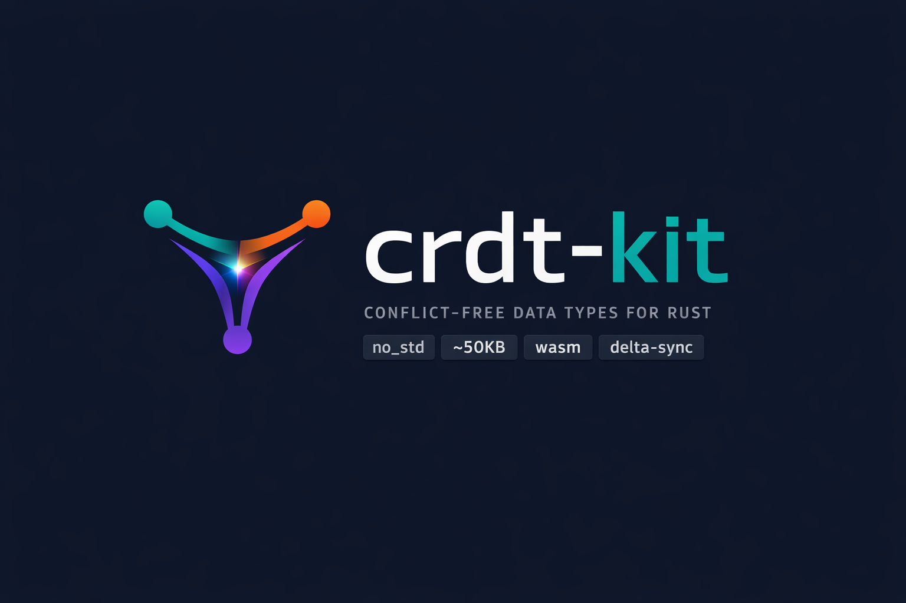

<div align="center">

<br>



<br><br>

[](https://crates.io/crates/crdt-kit)
[](https://crates.io/crates/crdt-kit)
[](https://docs.rs/crdt-kit)
[](https://github.com/crdt-kit/crdt-kit/actions)
[](LICENSE-MIT)

<br>

[**Website**](https://crdt-kit.github.io/crdt-kit/) &bull; [**Documentation**](https://docs.rs/crdt-kit) &bull; [**Crate**](https://crates.io/crates/crdt-kit) &bull; [**Examples**](./crates/crdt-kit/examples) &bull; [**Contributing**](CONTRIBUTING.md)

<br>

</div>

## Why crdt-kit?

Traditional sync solutions break when devices go offline. CRDTs solve this at the data structure level — every replica can be updated independently, and **merges always converge to the same result**, guaranteed by math, not by servers.

`crdt-kit` is built for **resource-constrained, latency-sensitive environments** where existing solutions (Automerge, Yjs) add too much overhead:

- **Zero heap allocations** on node IDs (`u64` instead of `String`)
- **`no_std` + `alloc`** — runs on bare metal, ESP32, Raspberry Pi
- **11 CRDT types** with delta-state sync, Hybrid Logical Clocks, and versioned serialization
- **Single dependency-free crate** (core) — optional `serde` and `wasm` features
- **Battle-tested** — 137 unit tests, 14 integration tests, property-based testing (proptest), 6 fuzz targets

```
+-----------+     +-----------+     +-----------+
|  Device A |     |  Device B |     |  Device C |
|  (offline)|     |  (offline)|     |  (offline)|
+-----+-----+     +-----+-----+     +-----+-----+
      |                 |                 |
      |  local edits    |  local edits    |  local edits
      |                 |                 |
      +--------+--------+--------+--------+
               |                 |
               v                 v
         +-----------+     +-----------+
         |   merge   |     |   merge   |
         +-----------+     +-----------+
               |                 |
               v                 v
          Same state!       Same state!    <-- Strong Eventual Consistency
```

---

## Quick Start

```toml
[dependencies]
crdt-kit = "0.5.1"
```

```rust
use crdt_kit::prelude::*;

// Two devices, working offline — NodeId is u64 (zero heap allocs)
let mut phone = GCounter::new(1);
phone.increment();
phone.increment();

let mut laptop = GCounter::new(2);
laptop.increment();

// When they reconnect — merge. Always converges.
phone.merge(&laptop);
assert_eq!(phone.value(), 3);
```

### Delta Sync (bandwidth-efficient)

```rust
use crdt_kit::prelude::*;

let mut edge = GCounter::new(1);
edge.increment_by(1000);

let mut cloud = GCounter::new(100);

// Send only what cloud doesn't have
let delta = edge.delta(&cloud);
cloud.apply_delta(&delta);
assert_eq!(cloud.value(), 1000);
```

### With Serde

```toml
[dependencies]
crdt-kit = { version = "0.5", features = ["serde"] }
```

### `no_std` (embedded / bare metal)

```toml
[dependencies]
crdt-kit = { version = "0.5", default-features = false }
```

---

## Available CRDTs

### Counters

| Type | Description | Real-world use |
|---|---|---|
| [`GCounter`](https://docs.rs/crdt-kit/latest/crdt_kit/struct.GCounter.html) | Grow-only counter | Page views, IoT sensor events, download counts |
| [`PNCounter`](https://docs.rs/crdt-kit/latest/crdt_kit/struct.PNCounter.html) | Increment & decrement | Inventory stock, likes/dislikes, seat reservations |

### Registers

| Type | Description | Real-world use |
|---|---|---|
| [`LWWRegister`](https://docs.rs/crdt-kit/latest/crdt_kit/struct.LWWRegister.html) | Last-writer-wins (HLC) | User profile fields, config settings, GPS location |
| [`MVRegister`](https://docs.rs/crdt-kit/latest/crdt_kit/struct.MVRegister.html) | Multi-value (shows conflicts) | Collaborative fields, version tracking |

### Sets

| Type | Description | Real-world use |
|---|---|---|
| [`GSet`](https://docs.rs/crdt-kit/latest/crdt_kit/struct.GSet.html) | Grow-only set | Seen message IDs, tags, audit logs |
| [`TwoPSet`](https://docs.rs/crdt-kit/latest/crdt_kit/struct.TwoPSet.html) | Add & permanent remove | Blocklists, revoked tokens |
| [`ORSet`](https://docs.rs/crdt-kit/latest/crdt_kit/struct.ORSet.html) | Add & remove freely | Shopping carts, todo lists, chat members |

### Maps

| Type | Description | Real-world use |
|---|---|---|
| [`LWWMap`](https://docs.rs/crdt-kit/latest/crdt_kit/struct.LWWMap.html) | Last-writer-wins per key | Sensor config, user preferences, feature flags |
| [`AWMap`](https://docs.rs/crdt-kit/latest/crdt_kit/struct.AWMap.html) | Add-wins (concurrent add beats remove) | Device registries, permission tables, metadata |

### Sequences

| Type | Description | Real-world use |
|---|---|---|
| [`Rga`](https://docs.rs/crdt-kit/latest/crdt_kit/struct.Rga.html) | Replicated Growable Array | Playlists, kanban boards, ordered lists |
| [`TextCrdt`](https://docs.rs/crdt-kit/latest/crdt_kit/struct.TextCrdt.html) | Collaborative text | Google Docs-style editing, shared notes |

### Traits

| Trait | Description |
|---|---|
| [`Crdt`](https://docs.rs/crdt-kit/latest/crdt_kit/trait.Crdt.html) | Core merge semantics (commutative, associative, idempotent) |
| [`DeltaCrdt`](https://docs.rs/crdt-kit/latest/crdt_kit/trait.DeltaCrdt.html) | Efficient delta sync — send only what changed (all 11 types) |
| [`Versioned`](https://docs.rs/crdt-kit/latest/crdt_kit/trait.Versioned.html) | Schema versioning for serialization envelopes (all 11 types) |
| [`VersionedEnvelope`](https://docs.rs/crdt-kit/latest/crdt_kit/struct.VersionedEnvelope.html) | Binary envelope format: 3-byte header + payload for wire/storage |

---

## v0.5 Highlights

### Zero-allocation Node IDs

All CRDTs use `NodeId` (`u64`) instead of `String` for replica identity. This eliminates heap allocations on every operation — critical for embedded and IoT targets.

```rust
// Before (v0.4): heap allocation on every construct
let mut c = GCounter::new("sensor-a".to_string());

// After (v0.5): zero-cost u64 identity
let mut c = GCounter::new(1);
```

### Hybrid Logical Clocks (native)

`LWWRegister` uses `HybridTimestamp` natively — physical clock + logical counter + node_id for total ordering. No more dual-timestamp correctness bugs.

```rust
use crdt_kit::clock::HybridClock;
use crdt_kit::prelude::*;

let mut clock = HybridClock::new(1);
let mut reg = LWWRegister::new("initial", &mut clock);
reg.set("updated", &mut clock);
```

### New Map Types

`LWWMap` and `AWMap` complete the CRDT toolbox for key-value workloads:

```rust
use crdt_kit::prelude::*;
use crdt_kit::clock::HybridTimestamp;

// LWWMap: per-key last-writer-wins
let mut config = LWWMap::new();
let ts = HybridTimestamp { physical: 100, logical: 0, node_id: 1 };
config.insert("sample_rate", 500, ts);

// AWMap: add-wins (concurrent add beats remove)
let mut registry = AWMap::new(1);
registry.insert("sensor-001", "zone-A");
```

---

## Examples

```bash
cargo run -p crdt-kit --example counter         # Distributed counters
cargo run -p crdt-kit --example todo_list        # Collaborative todo list
cargo run -p crdt-kit --example chat             # Chat with conflict detection
cargo run -p crdt-kit --example ecommerce        # E-commerce multi-store sync
cargo run -p crdt-kit --example iot_dashboard    # Full IoT sensor dashboard (all 11 CRDTs)
```

---

## Edge Computing & IoT

```rust
use crdt_kit::prelude::*;

// Edge sensor nodes count events independently
let mut sensor_a = GCounter::new(1);
let mut sensor_b = GCounter::new(2);

sensor_a.increment_by(142); // 142 events detected
sensor_b.increment_by(89);  // 89 events detected

// Gateway merges — order doesn't matter
sensor_a.merge(&sensor_b);
assert_eq!(sensor_a.value(), 231); // exact total, no double-counting

// Delta sync: only send what changed (saves bandwidth on LoRa/BLE)
let mut gateway = GCounter::new(100);
let delta = sensor_a.delta(&gateway);
gateway.apply_delta(&delta);
assert_eq!(gateway.value(), 231);
```

---

## Guarantees

All 11 CRDTs satisfy **Strong Eventual Consistency (SEC)**:

| Property | Meaning | Why it matters |
|---|---|---|
| **Commutativity** | `merge(a, b) == merge(b, a)` | Order of sync doesn't matter |
| **Associativity** | `merge(a, merge(b, c)) == merge(merge(a, b), c)` | Group syncs however you want |
| **Idempotency** | `merge(a, a) == a` | Safe to retry — no duplicates |

Verified by **151+ tests** (137 unit + 14 integration), **property-based testing** (proptest: commutativity, associativity, idempotency, and delta equivalence for all 11 types), and **6 fuzz targets** for crash resistance under arbitrary input.

---

## Benchmarks

```bash
cargo bench --bench crdt_benchmarks   # Core benchmarks (Criterion)
cargo bench --bench comparative       # vs Automerge & Yrs
```

---

## Feature Flags

| Feature | Default | Description |
|---|---|---|
| `std` | Yes | Standard library support |
| `serde` | No | Serialize/deserialize all CRDT types |
| `wasm` | No | WebAssembly bindings via wasm-bindgen |

For `no_std`, disable defaults: `default-features = false`

---

## Roadmap

- [x] G-Counter, PN-Counter
- [x] LWW-Register (HLC-native), MV-Register
- [x] G-Set, 2P-Set, OR-Set
- [x] LWW-Map, AW-Map (v0.5)
- [x] RGA List (ordered sequence)
- [x] Text CRDT (collaborative text, thin `Rga<char>` wrapper)
- [x] `no_std` support (embedded / bare metal)
- [x] `serde` serialization support
- [x] Delta-state optimization (11/11 types with `DeltaCrdt` trait)
- [x] HLC (Hybrid Logical Clock) — native `HybridTimestamp`
- [x] `NodeId` (`u64`) — zero heap allocations
- [x] Tombstone compaction for ORSet
- [x] Error handling for RGA/TextCrdt (`RgaError`, `TextError`)
- [x] WASM bindings (GCounter, PNCounter, LWWRegister, GSet, ORSet, TextCrdt)
- [x] Fuzz testing (6 targets via cargo-fuzz)
- [x] IoT Sensor Dashboard example (all 11 CRDTs)
- [x] `Versioned` trait with `CrdtType` enum for all 11 types
- [x] `HybridClock` derives `Debug + Clone`, accepts `NodeId` (u64)
- [x] RGA merge optimization (two-phase: tombstones then inserts, no index-shift loop)
- [x] Memory footprint benchmarks for embedded use case
- [ ] Network transport layer (TCP, WebSocket, QUIC)
- [ ] Sync protocol (delta-based replication)
- [ ] AWMap tombstone compaction
- [ ] Rope-backed RGA for large documents (>10K elements)

---

## Contributing

Contributions are welcome! Please read [CONTRIBUTING.md](CONTRIBUTING.md) before submitting a pull request.

## License

Dual-licensed under your choice of:

- **MIT** — [LICENSE-MIT](LICENSE-MIT)
- **Apache 2.0** — [LICENSE-APACHE](LICENSE-APACHE)
